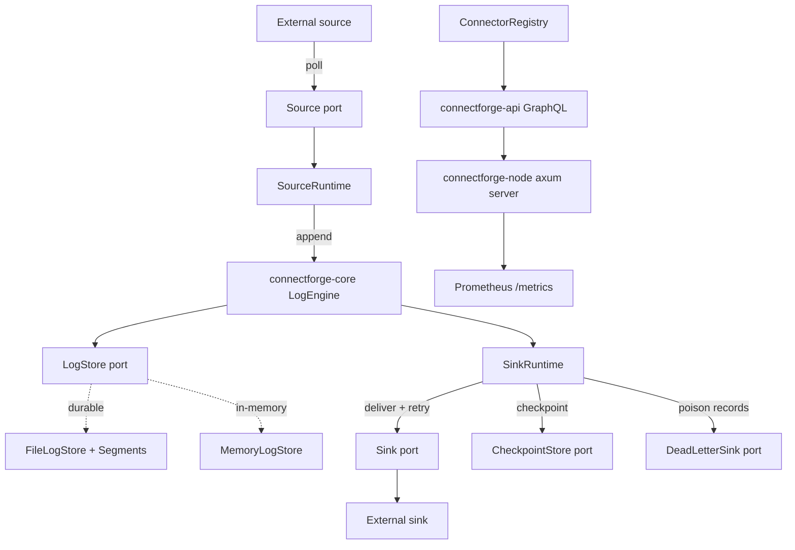
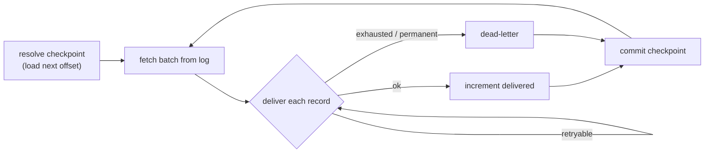
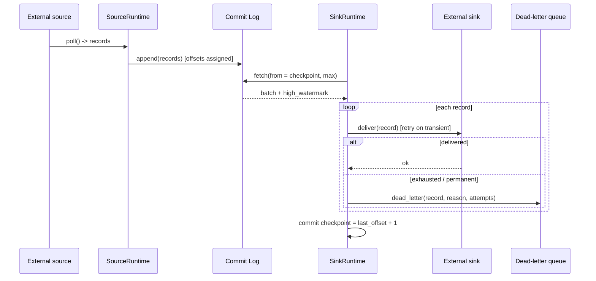

# ConnectForge

> A production-grade **connector SDK on a commit log** in Rust — source and sink
> connectors with **offset checkpointing**, **at-least-once delivery**, bounded
> **retries**, and a **dead-letter queue**, layered over a durable partitioned
> append-only log and exposed over GraphQL + WebSocket.

[](https://www.rust-lang.org)
[](https://doc.rust-lang.org/edition-guide/)
[](#license)
[](#test-results)
[](#test-results)
[](#safety)

---

## Table of Contents

- [Overview](#overview)
- [Why This Exists](#why-this-exists)
- [Architecture](#architecture)
- [Connector Runtime](#connector-runtime)
- [Delivery Semantics](#delivery-semantics)
- [Source → Log → Sink → DLQ Flow](#source--log--sink--dlq-flow)
- [Crate Layout](#crate-layout)
- [Getting Started](#getting-started)
- [GraphQL API](#graphql-api)
- [Resilience](#resilience)
- [Observability](#observability)
- [Benchmarks and Complexity](#benchmarks-and-complexity)
- [Test Results](#test-results)
- [Configuration](#configuration)
- [Docker and Monitoring](#docker-and-monitoring)
- [Safety](#safety)
- [License](#license)

---

## Overview

ConnectForge is a connector framework in the spirit of Kafka Connect / Apache
Iggy connectors. **Source** connectors poll an external system and **append**
records to a partitioned commit log; **sink** connectors **read** the log by
offset and **deliver** each record outward to an external system. The SDK owns
the hard parts so a connector author only implements a small `Source` or `Sink`
trait:

- **Offset checkpointing** — every sink persists a durable `Checkpoint` (the
  *next* offset to consume) so a restart resumes exactly where it left off,
  never re-scanning the whole log.
- **At-least-once delivery** — the checkpoint advances only after every record
  in a batch is delivered or dead-lettered, so a crash re-delivers rather than
  silently drops. An **at-most-once** mode (checkpoint before delivery) is also
  available.
- **Bounded retries** — transient delivery failures are retried with
  equal-jitter backoff; permanent failures short-circuit immediately.
- **Dead-letter queue** — records that exhaust their retries are routed to a
  `DeadLetterSink` with the failure reason, attempt count, and origin
  coordinates, keeping the pipeline flowing.
- **Durable, segmented log underneath** — the same append-only, offset-addressed
  storage core (rolling `.log` segments, crash recovery, retention) that backs a
  real broker.

Key properties:

- **Ports & adapters for connectors** — `Source`, `Sink`, `CheckpointStore`, and
  `DeadLetterSink` are traits; swap file, log, or in-memory implementations
  without touching the runtime.
- **Exactly-resumable** — the store owns offset authority; checkpoints are the
  *next* offset, so restarts are idempotent.
- **Observable** — per-connector status, live DLQ inspection, and Prometheus
  counters for delivered / dead-lettered / sourced records.
- **CQRS split** — produce/source (command) and fetch/sink (query) are separate
  paths over the log.
- **GraphQL + WebSocket** — connector status, DLQ, topics, and a live event
  subscription.

## Why This Exists

Moving data between systems reliably is the connector problem: *where did I stop,
what do I retry, and where do poison records go?* ConnectForge answers all three
from first principles — durable checkpoints, at-least-once with a DLQ, and a
segmented commit log as the buffer — with production concerns (resilience,
observability, recovery, back-pressure) built in.

## Architecture

Hexagonal (ports-and-adapters). Dependencies point **inward**; the domain core
never imports a web or filesystem framework — storage, delivery, checkpointing,
and dead-lettering are all ports.



## Connector Runtime

A `SinkRuntime` drives one `(topic, partition)`:



A `SourceRuntime` is the mirror image: `poll → append → advance`, emitting
records into the log for any number of sinks to consume independently.

## Delivery Semantics

| Mode | Checkpoint timing | Guarantee | On crash mid-batch |
|------|-------------------|-----------|--------------------|
| **At-least-once** (default) | *after* the batch is fully handled | no record is lost | re-delivers the batch (possible duplicates) |
| **At-most-once** | *before* delivery | no duplicates | may drop the in-flight batch |

Dead-lettering counts as "handled": the checkpoint advances past a poison record
(after it is safely in the DLQ), so the pipeline never wedges on one bad record.

## Source → Log → Sink → DLQ Flow



## Crate Layout

| Crate | Responsibility | Depends on |
|-------|----------------|------------|
| `connectforge-types` | Domain types: `Record`, `Offset`, connector types (`ConnectorId`, `Checkpoint`, `DeadLetterRecord`, `DeliveryReport`, `ConnectorStatus`), validation | — |
| `connectforge-resilience` | Timeout, retry, circuit breaker, rate limiter, bulkhead | — |
| `connectforge-core` | `LogEngine` + connector runtimes (`SinkRuntime`, `SourceRuntime`) and ports (`LogStore`, `Sink`, `Source`, `CheckpointStore`, `DeadLetterSink`) | types, resilience |
| `connectforge-infra` | `FileLogStore`, `MemoryLogStore`, `File/MemoryCheckpointStore`, `MemoryDeadLetterSink`, reference connectors (`GeneratorSource`, `CollectingSink`, `FailingSink`) | types, core |
| `connectforge-api` | async-graphql schema + `ConnectorRegistry` (connector status & DLQ) | types, core, infra |
| `connectforge-node` | axum server, connector supervisor, CLI, telemetry, demo, benches | all |

## Getting Started

```bash
# Build and test everything
cargo test --workspace

# Run the server (GraphQL playground at :8080/graphql). A background connector
# supervisor drives a demo source->sink pipeline so `connectors` / `deadLetters`
# return live data.
cargo run --release -- serve --addr 0.0.0.0:8080 --data-dir ./data

# In-memory server (non-durable)
cargo run --release -- serve

# In-process connector pipeline demo: source 20k records, sink at-least-once,
# dead-letter every 500th offset.
cargo run --release -- demo --records 20000 --fail-every 500
```

Demo output:

```
ConnectForge connector demo
  topic               : demo
  guarantee           : at-least-once
  records sourced     : 20000
  records delivered   : 19960
  records dead-lettered: 40
  dlq size            : 40
  pipeline throughput : ~2.2M records/sec
```

## GraphQL API

Nine root operations (well past the threshold where GraphQL beats REST):

| Type | Field | Purpose |
|------|-------|---------|
| Query | `connectors` | Live status of every registered connector |
| Query | `deadLetters` | Inspect the dead-letter queue |
| Query | `topics` | List all topics |
| Query | `topic(name)` | One topic's configuration |
| Query | `fetch(topic, partition, from, max)` | Read records by offset |
| Query | `stats` | Broker statistics |
| Mutation | `createTopic(name, partitions, ...)` | Create a topic |
| Mutation | `produce(topic, records)` | Append a batch of records |
| Subscription | `events(topics)` | Live append/create/truncate events (WebSocket) |

Example — inspect connectors and the DLQ:

```graphql
query {
  connectors { id kind guarantee running processed deadLettered checkpoint }
  deadLetters { connector topic partition offset reason attempts failedAt }
}
```

Example — create, produce, fetch:

```graphql
mutation { createTopic(name: "orders", partitions: 4) { name partitions } }

mutation {
  produce(topic: "orders", records: [
    { key: "user-1", payload: "placed order 42" },
    { payload: "system event" }
  ]) { baseOffset lastOffset count }
}

query {
  fetch(topic: "orders", partition: 0, from: 0, max: 100) {
    records { offset key payload timestamp }
    nextOffset highWatermark
  }
}
```

## Resilience

The `connectforge-resilience` crate provides composable, clock-injectable
primitives used on every I/O boundary:

- **Retry** with equal-jitter backoff powers sink delivery (no `rand`
  dependency — deterministic); retryable vs. permanent failures are classified
  by the `PortError` variant.
- **Timeout** bounds each storage/delivery operation.
- **Rate limiter** (token bucket) guards produce admission.
- **Circuit breaker** (Closed/Open/HalfOpen) and **bulkhead** (semaphore) are
  available for networked source/sink adapters.

All are unit-tested with a `ManualClock`, so no test sleeps.

## Observability

- **Structured tracing** (JSON) via `tracing` + `tracing-subscriber`.
- **Prometheus metrics** at `/metrics`, including:
  `connectforge_records_sourced_total{connector}`,
  `connectforge_records_delivered_total{connector}`,
  `connectforge_records_dead_lettered_total{connector}`,
  `connectforge_dlq_records_total`,
  plus the log-engine counters (`connectforge_records_produced_total`, …).
- **Health probes**: `/health/live`, `/health/ready`.

## Benchmarks and Complexity

Measured with the in-process `demo` (release build, in-memory backend):

| Stage | Records | Throughput | Notes |
|-------|---------|-----------|-------|
| Source → Log → Sink (at-least-once + DLQ) | 20K | **~2.2M records/sec** | poll + append + deliver + checkpoint |

Hot-path complexity:

| Operation | Time | Space | Notes |
|-----------|------|-------|-------|
| `SinkRuntime::run_once` | O(b) | O(b) | b = batch size; fetch + deliver + checkpoint |
| `SourceRuntime::run_once` | O(b) | O(b) | poll + single append |
| `deliver_one` (with retry) | O(a) | O(1) | a = attempts until success/permanent |
| checkpoint resolve | O(1) | O(1) | cached cursor; O(1) load on cold start |
| `Segment::append` | O(1) amortized | O(1) | buffered write + flush + index push |
| `Segment::read_from` | O(log s + k) | O(k) | s = segment records, k = returned |

Run the criterion micro-benchmark:

```bash
cargo bench -p connectforge-node
```

## Test Results

`cargo test --workspace` — **74 tests passing** across all crates:

| Crate | Tests | Focus |
|-------|-------|-------|
| `connectforge-types` | 16 | newtype validation, connector types, serde |
| `connectforge-resilience` | 10 | timeout/retry/breaker/limiter/bulkhead |
| `connectforge-core` | 15 | engine, sink/source runtimes, retry, DLQ, mocked ports |
| `connectforge-infra` | 21 | segments, file store recovery, checkpoints, DLQ, connectors |
| `connectforge-api` | 6 | end-to-end GraphQL: connectors, DLQ, produce/fetch |
| `connectforge-node` | 6 | axum handlers, CLI parsing, telemetry |

## Configuration

| Env / flag | Default | Meaning |
|------------|---------|---------|
| `CONNECTFORGE_ADDR` | `0.0.0.0:8080` | HTTP bind address |
| `CONNECTFORGE_DATA_DIR` | _(unset)_ | Durable store path; unset ⇒ in-memory |
| `CONNECTFORGE_MAX_TOPICS` | `1024` | Topic capacity |
| `CONNECTFORGE_SUB_BUFFER` | `4096` | Per-subscriber broadcast buffer |
| `--fail-every` (demo) | `1000` | Dead-letter every Nth offset (0 = never) |
| `RUST_LOG` | `info,connectforge=debug` | Tracing filter |

## Docker and Monitoring

```bash
# Build and run (durable data volume mounted at /data)
docker compose up --build

# With Prometheus + Grafana
docker compose --profile monitoring up --build
```

Prometheus scrapes `/metrics`; Grafana is available on `:3000` (admin/admin).

## Safety

Every crate sets `unsafe_code = "forbid"` — there is no `unsafe` in ConnectForge.

## License

MIT — see [LICENSE](LICENSE).
